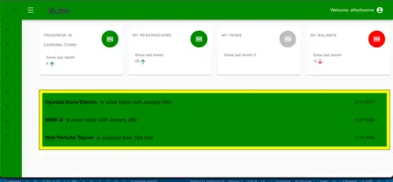
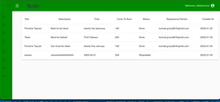
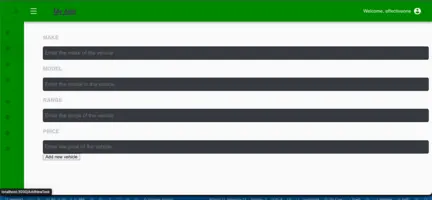
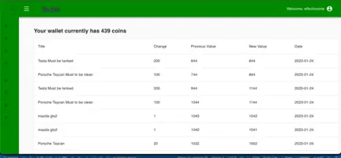
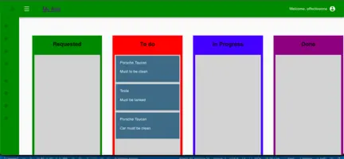
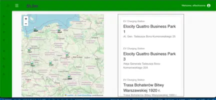

 <h1 align="center">MangoDb, Express, React, Node, Material UI, SASS, Redux, Jest, React Testing Library, Prettier, esLint, Boilerplate</h1>


## Electric Cars Management System
Welcome to our Electric Cars Management System! This project is designed to make it easy for users to manage and share electric cars, as well as rent them for a fee.

## Features
- Add Announcements: Users can add announcements to the system, which will be visible to all other users.
- Create Tasks: Users can create tasks, which will be assigned to specific cars and visible to all other users.
- Add Cars: Users can add cars to the system, which will be available for sharing and renting.
Rent Cars: Users can rent cars for a fee, which will be paid in coins.
- Map of Electric Stations: Users can view a map of electric stations, which will be helpful for finding charging locations.
Tech Stack

###Frontend: We used React to build the frontend of the application, along with various libraries such as Material-UI, Emotion, and Leaflet.
###Backend: We used Node.js as the backend of the application, along with Express.js and MongoDB.

## Screenshots
<div style="display: grid; grid-template-columns: repeat(2, 1fr); grid-template-rows: repeat(3, 1fr);">
  
  
  
  
  
  
</div>


##Getting Started
To get started, you'll need to have Node.js and MongoDB installed on your machine. Once you have these, you can clone the repository and run the following commands:

``` npm install ```
This command will install all the necessary dependencies for the project.

``` npm run start```
This command will start the development server for the frontend.

```npm run server```
This command will start the server for the backend.


## Contributions
We welcome contributions to the project! If you have any ideas or issues you'd like to report, feel free to create a new issue or pull request.

## Future Plans
In the future, we plan to add new features to the application, such as the ability to make reservations and view statistics about the usage of the cars.

## License
This project is licensed under the MIT License. See the LICENSE file for more information.

##👨‍💻 Connect with me
Konrad.gruca90@gmail.com
